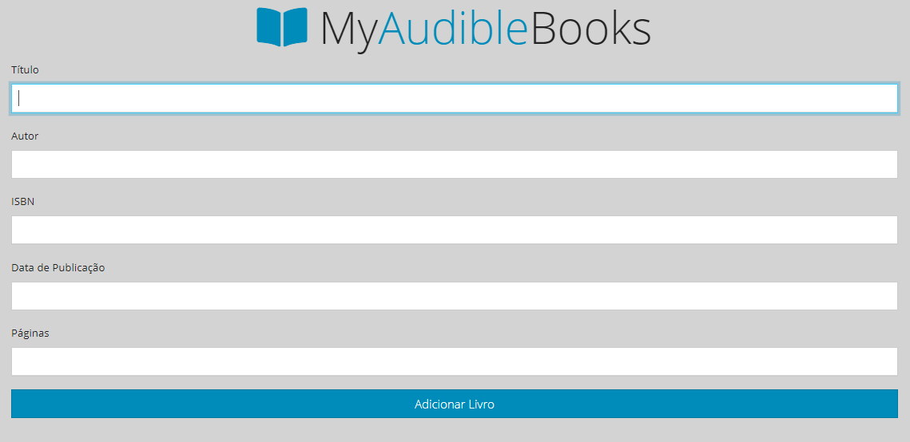

# Desafio: Biblioteca

## 1. Introdução

Vocês estão atuando como *freelancers* em um projeto para uma biblioteca. 

O cliente pediu para que vocês desenvolvessem uma página onde é possível **(i)** inserir informações relevantes sobre novos livros adquiridos pela biblioteca, e **(ii)** visualizar as informações dos livros que foram inseridos anteriormente no sistema.

## 2. Detalhes Técnicos do Projeto:

A tela inicial deve conter duas partes essenciais: 

- um formulário para inserção das informações dos livros:
 

- uma listagem dos livros que forem adicionados pelo usuário.
  

## 3. Tecnologias Utilizadas:

- HTML;
- CSS;
- *Vanilla.js*: não será permitida a utilização de bibliotecas nesse projeto.

## 4. Critérios Técnicos do Projeto: 

1. O formulário de inserção dos livros deve conter campos para os seguintes campos obrigatórios: **Autor, Título, ISBN e Data de Publicação**. Contudo, sintam-se à vontade para inserirem novos campos no formulário caso prefiram.

2. Um livro não pode ser adicionado sem as informações obrigatórias acima mencionadas *(Autor, Título, ISBN e Data de Publicação)*. Logo, o seu código deve prever um tratamento de erro, informando ao usuário a necessidade de preencher as informações obrigatórias faltantes.

3. Está sendo disponibilizado um arquivo .json para que vocês terem uma ideia dos dados relevantes na inserção de dados sobre livros para uma biblioteca.

4. Ao clicar no botão responsável por adicionar o livro, as informações devem ser imediatamente inseridas e visualizadas na listagem localizada abaixo do formulário. 
   
5. O livro adicionado poderá ser deletado pelo usuário.
   
6. **Na listagem dos livros inseridos, deverá vir uma informação nova, denominada "Data da inserção", contendo a data e o horário em que o livro foi inserido no sistema**.
   
7. É preciso seguir a estrutura de repositório contida nessa pasta "Exercício de Casa".
   
8. *Estilização*: o estilo dos prints colocados acima são apenas sugestões; a estilização da página fica a critério da aluna.
   
## 5. Itens Adicionais e não Obrigatórios do Projeto: 

1. Permanência dos Dados: encontrar um meio para que as informações permaneçam na tela do usuário mesmo após a atualização da página.
   
2. CSS Responsivo. 